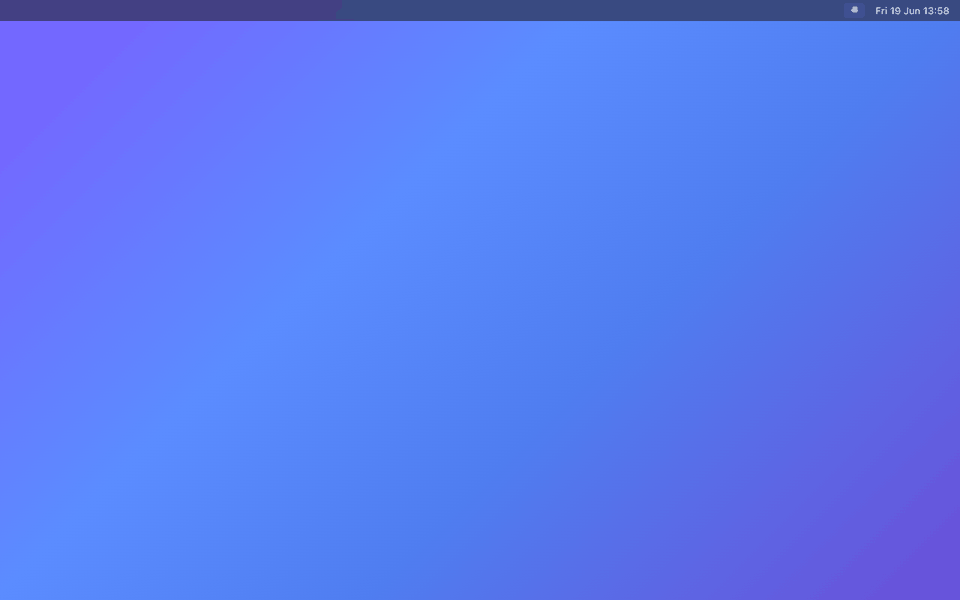
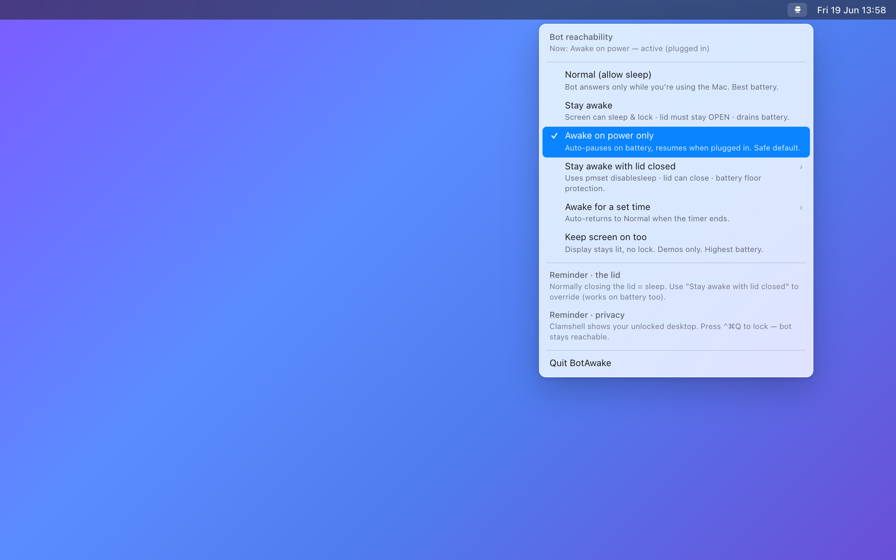

# BotAwake ☕

<div align="center">

**Keep your Mac awake so your bots, daemons, and listeners never go silent.**

A one-click menu-bar switch. No background drain, no system settings touched, no dependencies.

[🇬🇧 English](#english) · [🇨🇳 中文](#中文)

</div>

---

## English

### Why BotAwake?

You leave a chat bot, a sync daemon, or a long-running listener on your Mac. You walk away.
The Mac dozes off — and your bot goes silent. Messages pile up unanswered until you wiggle
the mouse and wake it back up.

**BotAwake fixes that with one click.** A small cup icon lives in your menu bar:

- **Filled cup** ☕ → your Mac is staying awake, your bot is reachable.
- **Empty cup** → your Mac is free to sleep normally.

It's a thin, transparent wrapper around Apple's own `caffeinate` and `pmset` — so it's
fast, safe, and never secretly changes your power settings.

> **Origin story:** Built to fix one real annoyance — a Feishu/Lark bot whose listener went
> silent every time the Mac dozed off, only replying once the machine woke again.



### Pick the mode that fits

Click the cup icon and choose how awake you want to be. Most people only ever need the
default (**Awake on power only**).



| Mode | Best for | Keeps awake when… | Battery cost |
|------|----------|-------------------|--------------|
| **Awake on power only** ★ *(default)* | Daily use, plugged in at a desk | Plugged in; auto-pauses on battery | None — never drains battery |
| **Stay awake** | Quick "don't sleep right now" | Lid is **open** (screen may lock) | High |
| **Awake for a set time** | A meeting, a download, a build | Next 1h or 4h, then back to Normal | Limited |
| **Stay awake with lid closed** | Closing the laptop but keeping the bot live | Lid is **closed**, even on battery | Medium (with battery floor) |
| **Keep screen on too** | Live demos, dashboards | Display stays lit, no lock | Highest |
| **Normal (allow sleep)** | Turning it all off | Never — factory behavior | Best |

> **The one rule worth knowing:** screen off or locked is **not** the same as asleep. In every
> awake mode your Mac keeps running underneath, so the bot stays reachable even with a dark,
> locked screen. The *only* thing that normally puts it fully to sleep is **closing the lid** —
> and that's exactly what **"Stay awake with lid closed"** overrides.

### Closing the lid? Use Lid-Closed mode

Normally, shutting the laptop lid puts the Mac to sleep and your bot goes offline. The
**"Stay awake with lid closed"** mode keeps it running anyway — even on battery — by using
Apple's `pmset disablesleep`.

**One click, no Terminal.** The first time you pick this mode, macOS shows its standard
authorization dialog (Touch ID or your password). Approve it once and you're set — every
time after that, toggling lid-closed mode is instant and silent. Cancel the dialog and
BotAwake quietly stays in Normal mode. *(Under the hood, that one approval writes a small
sudoers whitelist at `/etc/sudoers.d/botawake`; `uninstall.sh` removes it.)*

**Battery protection built in.** Choose a floor of **10% / 20% / 30%**. If you're on battery
and drop below it, BotAwake automatically lets the Mac sleep so you don't come back to a
dead laptop.

**It cleans up after itself:**
- Switch to any other mode → lid-closed override clears immediately.
- Quit BotAwake → override clears.
- App crashes or is force-killed → it detects the leftover **`SleepDisabled`** kernel flag
  (`pmset -g`) and clears it on next launch.
- **Normal** mode re-checks every 15 seconds and clears a stuck sleep lock if one is found.

> **Privacy heads-up:** with the lid closed but an external display attached (clamshell),
> macOS shows your **unlocked desktop** on that monitor. Press
> <kbd>⌃</kbd><kbd>⌘</kbd><kbd>Q</kbd> to lock the screen — the bot stays reachable while locked.

### Is my bot reachable? Quick reference

| Situation | Reachable? |
|-----------|:----------:|
| Lid open, screen off or locked, any awake mode on | ✅ |
| Lid closed + **Lid-Closed mode** | ✅ |
| Lid closed, plugged in + external display (clamshell) | ✅ |
| Lid closed, plugged in, no display, *normal* modes | ❌ sleeps |
| Lid closed, on battery, *normal* modes | ❌ sleeps |

### Install

```bash
git clone https://github.com/Junweiw/BotAwake.git
cd BotAwake
chmod +x build.sh install.sh uninstall.sh
./install.sh
```

This builds `BotAwake.app`, copies it to `~/Applications`, and registers a login agent so
the cup icon comes back automatically every time you log in. It starts in **Normal** mode —
nothing changes until you choose a mode.

**Requirements:** macOS 14 (Sonoma) or later, and Xcode command-line tools (`swiftc`) —
install with `xcode-select --install`. macOS only (built on `AppKit`, `caffeinate`, `pmset`,
`launchd`); it does not run on Windows or Linux.

#### Build only (no install)

```bash
./build.sh          # produces dist/BotAwake.app
open dist/BotAwake.app
```

#### Uninstall

```bash
./uninstall.sh      # removes the app, login agent, and the sudoers whitelist
```

#### Installing from an AI agent / non-interactive setup

`install.sh` will `sudo` to pre-create the lid-closed sudoers whitelist, which needs a TTY
password prompt. If you're driving this from an automation agent that can trigger GUI
dialogs, create the whitelist through the native auth dialog instead — no Terminal password:

```bash
osascript -e 'do shell script "
echo \"# BotAwake: allow NOPASSWD pmset disablesleep for lid-closed mode\" > /etc/sudoers.d/botawake
echo \"Cmnd_Alias BOTAWAKE = /usr/bin/pmset -a disablesleep 1, /usr/bin/pmset -a disablesleep 0\" >> /etc/sudoers.d/botawake
echo \"ALL ALL=(ALL) NOPASSWD: BOTAWAKE\" >> /etc/sudoers.d/botawake
chmod 0440 /etc/sudoers.d/botawake
" with administrator privileges with prompt "BotAwake needs to create a sudoers whitelist for lid-closed awake mode."'
```

If your environment can't show GUI dialogs at all, skip this entirely — **the app sets it up
itself** the first time a user picks lid-closed mode from the menu.

### How it works

BotAwake never edits your saved system power settings. Each mode just starts or stops a
small background process with the right flags:

| Mode | Mechanism |
|------|-----------|
| Stay awake / Power only / Timed | `caffeinate -i -m -s` — blocks idle **system** sleep; display is free to turn off and lock |
| Keep screen on too | adds `-d` — also blocks display sleep |
| Awake on power only | polls `pmset -g batt`, runs `caffeinate` only while on AC |
| Timed | adds `-t <seconds>`; auto-returns to Normal when the timer ends |
| Lid closed | `pmset -a disablesleep 1` via a one-time-approved sudoers rule — works with the lid shut |

Quitting BotAwake (or choosing **Normal**) stops `caffeinate` immediately and clears any
lid-closed **`SleepDisabled`** flag — the Mac is free to sleep again.

### Troubleshooting: "Normal" but my Mac still won't sleep

BotAwake only controls its own `caffeinate` child and the lid-closed **`SleepDisabled`**
flag. Other things can still block sleep:

| Check | Command | What it means |
|-------|---------|---------------|
| BotAwake sleep lock | `pmset -g \| rg SleepDisabled` | Should be **`0`** in Normal. If **`1`**, run `sudo pmset -a disablesleep 0` or quit and reopen BotAwake (v1.1.1+). |
| BotAwake caffeinate | `pgrep -lf caffeinate` | Should be empty in Normal. |
| Other apps | `pmset -g assertions \| head -25` | Cursor, Handoff (`sharingd`), video calls, etc. often hold idle-sleep assertions. |
| Display timeout | `pmset -g custom \| rg displaysleep` | If **`displaysleep 0`** on battery, the screen never dims — fix with `sudo pmset -b displaysleep 10` (or your preferred minutes). |

**Quick test:** choose **Normal**, quit Cursor, leave the Mac idle for your display-sleep
interval (~10 min by default). See [CHANGELOG.md](CHANGELOG.md) for release history.

### License

MIT — see [LICENSE](LICENSE).

[⬆ Back to top](#botawake-)

---

## 中文

### 为什么需要 BotAwake？

你在 Mac 上挂着一个聊天机器人、同步守护进程或长时间运行的监听器，然后人离开了。
Mac 一打盹——机器人就静默了。消息堆积无人回复，直到你晃一下鼠标把它唤醒。

**BotAwake 一键解决这个问题。** 菜单栏里有一个小茶杯图标：

- **实心茶杯** ☕ → Mac 正在保持唤醒，机器人在线可达。
- **空心茶杯** → Mac 可以正常休眠。

它只是对 Apple 自带的 `caffeinate` 和 `pmset` 的一层轻薄、透明封装——快速、安全，
**绝不偷偷修改你的电源设置**。

> **诞生故事：** 为解决一个真实痛点而生——飞书机器人在 Mac 休眠后静默无响应，
> 只有唤醒机器后才回复消息。


### 选择适合你的模式

点击茶杯图标，选择你想要的唤醒程度。大多数人只需要默认的 **仅电源下唤醒**。


| 模式 | 适用场景 | 何时保持唤醒 | 耗电 |
|------|----------|--------------|------|
| **仅电源下唤醒** ★ *（默认）* | 接通电源、桌面日常使用 | 接通电源时；使用电池时自动暂停 | 不耗电 |
| **保持唤醒** | 临时"现在别睡" | **开盖** 时（屏幕可锁定） | 较高 |
| **定时唤醒** | 一场会议、一次下载、一次编译 | 接下来 1 或 4 小时，然后恢复 Normal | 有限 |
| **合盖唤醒** | 合上笔记本但保持机器人在线 | **合盖** 时，即使用电池 | 中等（含电量底线） |
| **屏幕常亮** | 现场演示、仪表盘 | 显示器保持点亮，不锁定 | 最高 |
| **Normal（允许休眠）** | 全部关闭 | 从不——出厂默认行为 | 最佳 |

> **唯一值得记住的规则：** 屏幕关闭或锁定 **不等于** 休眠。在任意唤醒模式下，
> Mac 底层仍在运行，所以即便屏幕黑屏锁定，机器人依然可达。唯一会让它真正完全休眠的
> 操作是 **合盖**——而这正是 **"合盖唤醒"** 模式所覆盖的。

### 要合盖？用合盖唤醒模式

通常合上笔记本盖子会让 Mac 休眠、机器人离线。**"合盖唤醒"** 模式通过 Apple 的
`pmset disablesleep` 让它继续运行——即使使用电池也有效。

**一键搞定，无需终端。** 首次选择此模式时，macOS 会弹出标准授权对话框
（Touch ID 或密码）。批准一次即可——此后每次切换合盖模式都是即时、无声的。
取消对话框，BotAwake 会安静地留在 Normal 模式。*（底层上，这一次批准会写入一个
小的 sudoers 白名单 `/etc/sudoers.d/botawake`；`uninstall.sh` 会移除它。）*

**内置电量保护。** 可选 **10% / 20% / 30%** 底线。若你在用电池且电量跌破底线，
BotAwake 会自动让 Mac 休眠，避免你回来时面对一台没电的笔记本。

**它会自我清理：**
- 切换到其他任意模式 → 合盖覆盖立即清除。
- 退出 BotAwake → 覆盖清除。
- 应用崩溃或被强制退出 → 下次启动时检测残留的 **`SleepDisabled`** 内核标志
  （`pmset -g`）并清除。
- **Normal** 模式每 15 秒复查一次，发现残留睡眠锁会自动清除。

> **隐私提醒：** 合盖但接有外接显示器（翻盖模式）时，macOS 会在该显示器上显示你的
> **未锁定桌面**。按 <kbd>⌃</kbd><kbd>⌘</kbd><kbd>Q</kbd> 锁屏——锁定状态下机器人仍可达。

### 我的机器人可达吗？速查表

| 场景 | 可达？ |
|------|:------:|
| 开盖，屏幕关闭或锁定，任意唤醒模式开启 | ✅ |
| 合盖 + **合盖唤醒模式** | ✅ |
| 合盖，接电源 + 外接显示器（翻盖模式） | ✅ |
| 合盖，接电源，无显示器，*普通* 模式 | ❌ 休眠 |
| 合盖，用电池，*普通* 模式 | ❌ 休眠 |

### 安装

```bash
git clone https://github.com/Junweiw/BotAwake.git
cd BotAwake
chmod +x build.sh install.sh uninstall.sh
./install.sh
```

脚本会编译 `BotAwake.app`，复制到 `~/Applications`，并注册登录启动项，每次登录时
茶杯图标自动出现。启动后为 **Normal** 模式——在你选择模式之前什么都不会改变。

**系统要求：** macOS 14 (Sonoma) 或更高版本，以及 Xcode 命令行工具（`swiftc`，
运行 `xcode-select --install` 安装）。仅限 macOS（基于 `AppKit`、`caffeinate`、`pmset`、
`launchd` 构建），不支持 Windows 或 Linux。

#### 仅编译（不安装）

```bash
./build.sh          # 生成 dist/BotAwake.app
open dist/BotAwake.app
```

#### 卸载

```bash
./uninstall.sh      # 移除应用、登录启动项和 sudoers 白名单
```

#### 从 AI 代理 / 非交互式环境安装

`install.sh` 会用 `sudo` 预先创建合盖模式的 sudoers 白名单，这需要终端密码输入。
如果你通过能触发 GUI 对话框的自动化代理来操作，可改用系统授权对话框创建白名单——
无需终端密码：

```bash
osascript -e 'do shell script "
echo \"# BotAwake: allow NOPASSWD pmset disablesleep for lid-closed mode\" > /etc/sudoers.d/botawake
echo \"Cmnd_Alias BOTAWAKE = /usr/bin/pmset -a disablesleep 1, /usr/bin/pmset -a disablesleep 0\" >> /etc/sudoers.d/botawake
echo \"ALL ALL=(ALL) NOPASSWD: BOTAWAKE\" >> /etc/sudoers.d/botawake
chmod 0440 /etc/sudoers.d/botawake
" with administrator privileges with prompt "BotAwake needs to create a sudoers whitelist for lid-closed awake mode."'
```

如果你的环境完全无法弹出 GUI 对话框，可直接跳过——**应用会在用户首次从菜单选择
合盖模式时自动完成设置。**

### 原理

BotAwake 从不修改你保存的系统电源设置。每种模式只是用对应参数启动或停止一个
小后台进程：

| 模式 | 机制 |
|------|------|
| 保持唤醒 / 仅电源 / 定时 | `caffeinate -i -m -s` — 阻止空闲 **系统** 休眠；显示器可正常关闭锁定 |
| 屏幕常亮 | 增加 `-d` — 同时阻止显示器休眠 |
| 仅电源下唤醒 | 轮询 `pmset -g batt`，仅在接通电源时运行 `caffeinate` |
| 定时 | 增加 `-t <秒>`；计时结束自动返回 Normal |
| 合盖唤醒 | 通过一次性授权的 sudoers 规则执行 `pmset -a disablesleep 1`——合盖时仍有效 |

退出 BotAwake（或选择 **Normal**）会立即停止 `caffeinate`，并清除合盖模式的
**`SleepDisabled`** 标志——Mac 恢复正常休眠。

### 故障排查："Normal" 但 Mac 仍不睡眠

BotAwake 只控制自身的 `caffeinate` 子进程和合盖模式的 **`SleepDisabled`** 标志。
其他因素仍可能阻止睡眠：

| 检查项 | 命令 | 含义 |
|--------|------|------|
| BotAwake 睡眠锁 | `pmset -g \| rg SleepDisabled` | Normal 下应为 **`0`**。若为 **`1`**，运行 `sudo pmset -a disablesleep 0` 或退出并重新打开 BotAwake（v1.1.1+）。 |
| BotAwake caffeinate | `pgrep -lf caffeinate` | Normal 下应为空。 |
| 其他应用 | `pmset -g assertions \| head -25` | Cursor、Handoff（`sharingd`）、视频会议等常持有 idle-sleep 断言。 |
| 显示器超时 | `pmset -g custom \| rg displaysleep` | 若电池下 **`displaysleep 0`**，屏幕永不熄灭——可用 `sudo pmset -b displaysleep 10` 修复。 |

**快速测试：** 选择 **Normal**，退出 Cursor，空闲等待显示器休眠间隔（默认约 10 分钟）。
详见 [CHANGELOG.md](CHANGELOG.md)。

### 许可证

MIT — 详见 [LICENSE](LICENSE)。

[⬆ 返回顶部](#botawake-)
